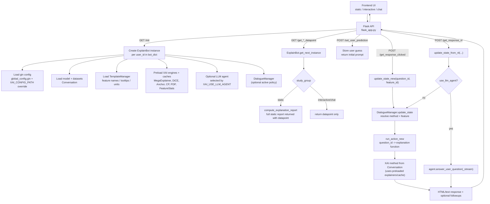
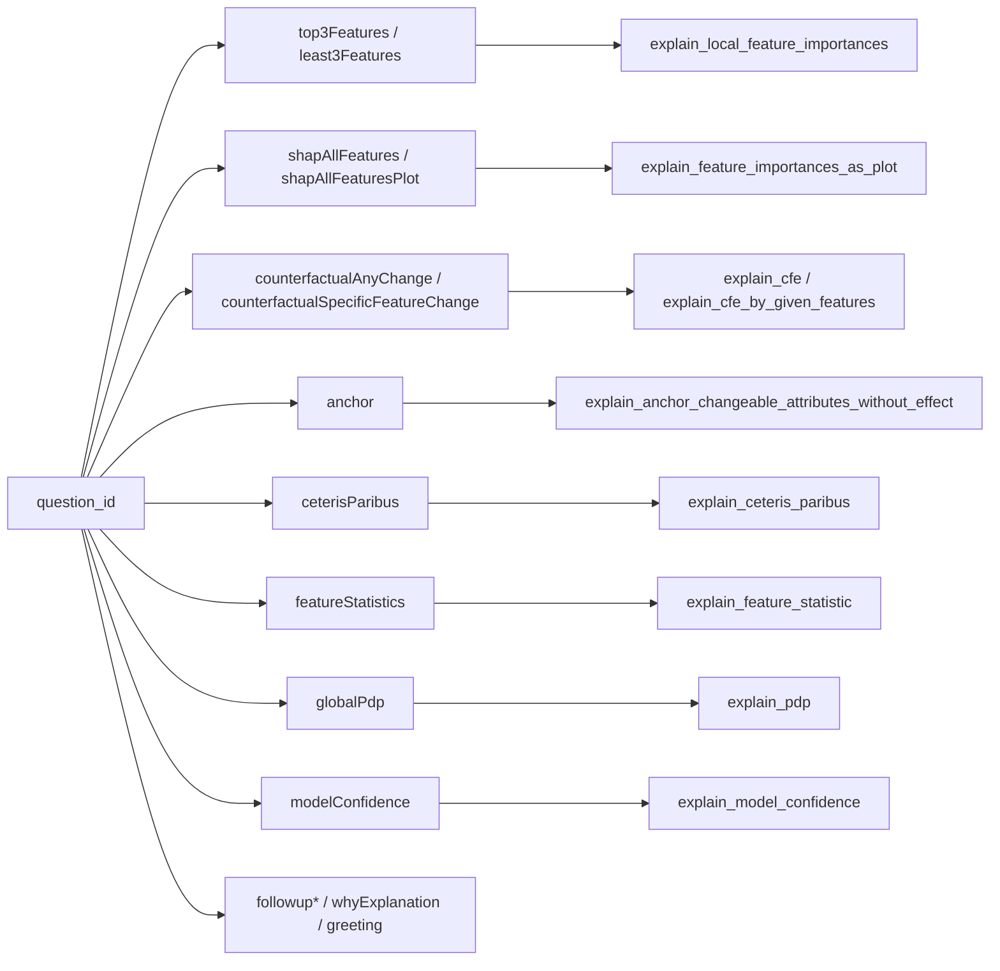

# Backend Architecture: Information Flow and XAI Execution

This document explains how data flows through the backend and how configuration controls behavior.

## 1) End-to-end flow

## 2) Explanation dispatch (how methods are called)

`ExplainBot.update_state_new(...)` calls `run_action_new(...)` in `explain/action.py`, which dispatches by `question_id`:

All of these functions read explainer objects from `Conversation` that were initialized in `ExplainBot.load_explanations(...)`.

## 3) What settings influence

### Runtime/env settings
- `XAI_CONFIG_PATH`: chooses dataset-specific gin config file; overrides `GlobalArgs.config`.
- `XAI_USE_LLM_AGENT`: selects agent family (`mape_k`, `mape_k_2`, `conversational`, etc.) or disables LLM agent.
- `ML_EXECUTOR_THREADS`: size of backend thread pool for heavy inference/explanation calls.

### Gin settings (dataset and behavior)
From `configs/*-config.gin` (example `configs/adult-config.gin`):
- Data/model wiring: model path, dataset path, categorical mapping, encoded mapping.
- Semantics shown in UI/prompts: class names, instance naming, dataset descriptions.
- Behavior toggles:
  - `ExplainBot.use_intent_recognition`
  - `ExplainBot.use_active_dialogue_manager`
  - `ExplainBot.use_static_followup`
  - `ExplainBot.submodular_pick`
- XAI/cache parameters:
  - `MegaExplainer.cache_location`
  - `TabularDice.cache_location`
  - `TabularAnchor.cache_location`
  - `CeterisParibus.cache_location`
  - `PdpExplanation.cache_location`
  - `DiverseInstances.*`, `TestInstances.*`, `Explanation.max_cache_size`

### Study mode switch (static vs interactive/chat)
`study_group` is passed on `/init`:
- `static`: on `/get_train_datapoint`, backend attaches `static_report` (precomputed multi-method report).
- `interactive` and `chat`: user asks incrementally; backend serves per-question explanations.
- `chat` with LLM agent: NL goes through agent path (MAPE-K/conversational variants).

## 4) Role of templates

`TemplateManager` (`data/response_templates/template_manager.py`) standardizes:
- feature display names
- tooltips/units
- decoding categorical/encoded values

This layer affects how explanation outputs are rendered, but not model predictions themselves.

## 5) Where cache is used

- Method-level caches: each explainer persists artifacts to `./cache/*.pkl`.
- Cross-method per-instance cache: `XAICacheManager` stores full XAI reports (`./cache/{dataset}-xai-reports.pkl`) used for fast LLM-agent datapoint initialization.

## 6) Fast mental model

1. `flask_app.py` manages sessions/endpoints and delegates all intelligence to `ExplainBot`.
2. `ExplainBot` builds a `Conversation` with model+data+all explainers once, then serves each turn.
3. `run_action_new(question_id, feature_id)` is the central dispatch for explanation method execution.
4. Settings decide: dataset wiring, mode (static/interactive/chat), and whether NL is rule-based or LLM-agent based.
